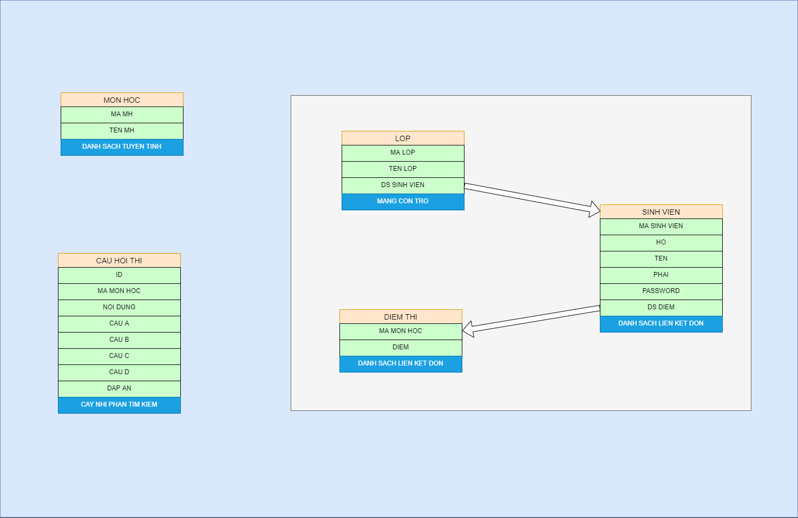

# **Quiz Program**

<!-- ABOUT THE PROJECT -->
## About The Project

---------------

Thi trắc nghiệm : Ta tổ chức các danh sách sau:

1. Danh sách môn học: **danh sách tuyến tính** (<ins>MAMH</ins> (C15), TENMH).
2. Danh sách Lop : **mảng con trỏ** (<ins>MALOP</ins>, TENLOP, con trỏ): con trỏ sẻ trỏ đến danh sách sinh viên thuộc lớp đó.
3. Danh sách sinh viên : **danh sách liên kết đơn** (<ins>MASV</ins>, HO, TEN, PHAI, password, con trỏ): con trỏ sẽ trỏ đến điểm các môn đã thi trắc nghiệm.
4. Danh sách Điểm thi (**danh sách liên kết đơn**) (<ins>Mamh</ins>, Diem)
5. Danh sách Câu hỏi thi (**cây nhị phân tìm kiếm với key = Id**) (<ins>Id</ins>, Mã MH, Nội dung, A, B, C, D, Đáp án); trong đó A, B, C, D là 4 chọn lựa tương ứng với nội dung câu hỏi.

---

Chương trình có các chức năng sau : \
a/ Đăng nhập dựa vào mã sinh viên, password. Nếu tài khoản đăng nhập là GV, pass là GV thì sẽ có toàn quyền .\
b/ NhapLop\
c/ In ds lớp\
d/ Nhập sinh viên của lớp : nhập vào mã lớp trước, sau đó nhập các sinh viên vào lớp đó. \
e/ Nhập môn học: cho phép cập nhật (thêm / xóa / hiệu chỉnh ) thông tin của môn học\
f/ Nhập câu hỏi thi (Id là số ngẫu nhiên do chương trình tự tạo )\
g/ Thi Trắc nghiệm ( trước khi thi hỏi người thi môn thi, số câu hỏi thi, số phút thi-sau đó lấy ngẫu nhiên các câu hỏi trong danh sách câu hỏi thi của môn; \
h/ In chi tiết các câu hỏi đã thi 1 môn học của 1 sinh viên, \
i/ In bảng điểm thi trắc nghiệm môn học của 1 lớp (nếu có sinh viên chưa thi thì ghi “Chưa thi”.\
**Lưu ý: Chương trình cho phép lưu các danh sách vào file; Kiểm tra các điều kiện làm dữ liệu bị sai. Sinh viên có thể tự thiết kế thêm danh sách để đáp ứng yêu cầu của đề tài.**\

---
